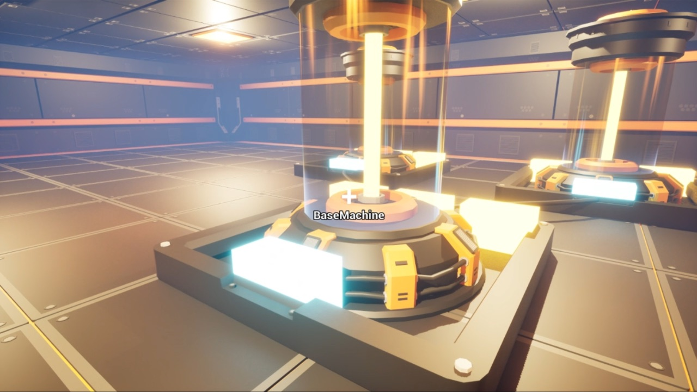

# EscapeFactory

Unreal Engine 5에서 C++과 블루프린트를 함께 써서 만든 1인칭 공장 자동화 프로젝트입니다(2026.02, 1인). 게임 안의 모든 액터를 "아이템"으로 추상화하는 것이 설계의 축입니다.



- 기술 Unreal Engine 5, C++, Blueprint, Enhanced Input

## 시스템

- **아이템 추상화** — 소품·기계·플레이어 보유물을 하나의 타입으로 통합합니다. 정의는 데이터 에셋(EFItemDataAsset — IronOre, IronBar, IronPowder, Scrap)에, 개별 동작과 연출은 블루프린트에 둡니다. 새 아이템을 추가할 때 기존 코드 수정이 최소화됩니다.
- **인벤토리** — 플레이어·기계·컨테이너가 같은 EFInventoryComponent를 공유하고, 슬롯 단위 드래그 앤 드롭(EFInventoryDragDropOp)으로 액터 간 아이템을 옮깁니다.
- **기계** — EFMachineBase가 입력 → 가공 → 출력의 공통 사이클을 갖고, 레시피는 EFRecipeDataAsset(IronBar, IronPowder, Scrap)으로 분리해 코드 변경 없이 공정을 추가합니다. 기계 메뉴·레시피 선택 위젯.
- **상호작용** — EFInteractable 인터페이스와 상호작용 위젯, 드롭 아이템 액터, Enhanced Input 액션(Move, Look, Jump, Interaction, Inventory).

## 구조

```text
Source/EscapeFactory/       EF* C++ 코어 (캐릭터 · 컨트롤러 · 인벤토리 · 기계 · 위젯 · 데이터 에셋)
Content/EscapeFactory/
  Blueprints/               BP_BasicMachine, BP_DropItem, BP_EFCharacter, BP_EFGameMode, BP_EFPlayerController
  DataAssets/Item · Recipe/ 아이템 · 레시피 데이터 에셋
  UI/                       인벤토리 · 기계 메뉴 · 레시피 선택 · 상호작용 위젯
  Level/                    PlayLevel, TestLevel
```
